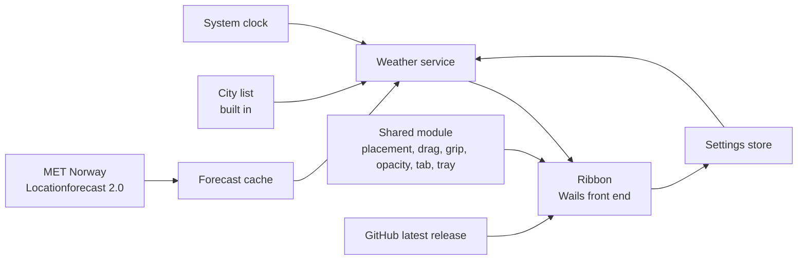

# WeatherRibbon: Requirements Specification

Status: baselined by Oliver on 2026-10-05. Section 11 records the rulings that closed its open
questions; none is open. Later changes arrive as dated amendments, listed here and cited by number
where they apply.

## Amendments

| No. | Date | Change |
|---|---|---|
| 1 | 2026-10-05 | `ribbonkit`'s front-end half is an npm package at the repository root beside `go.mod`, each application depending on it by git tag; an npm workspace cannot span two repositories. It is first carved inside TimeRibbon, then lifted into its own repository (CON-10, OQ-9, section 8). |
| 2 | 2026-10-05 | Running beside TimeRibbon the ribbon never lands on it, through an occupancy folder the shared module owns (FR-506, TimeRibbon's FR-412); built in the module before it is lifted out (section 8). |
| 3 | 2026-10-05 | Brought up to the kit as built: on macOS the Dock icon stays, as TimeRibbon's Amendment 36 (FR-101); `ribbonkit` exists at v0.1.1 with TimeRibbon 2.7.0 released on it (CON-10, section 8); the Flatpak is granted the occupancy folder (section 5). 24-hour time when none is held (FR-401); a place with no region name (FR-202); the detail panel without a forecast or sun times (FR-410, FR-411); NFR-C-2 measured. Oliver's rulings of the same day. |
| 4 | 2026-10-05 | The petrichor moment (FR-413; OQ-13 to OQ-16). Oliver's request and rulings of the same day. |
| 5 | 2026-10-05 | One unreadable city entry leaves the others working, as TimeRibbon's FR-705 (FR-804); a period giving no rain figure is neither wet nor dry; the petrichor line goes only once the city is found dry (FR-413). Found while building the domain; Oliver's ruling the same day. |
| 6 | 2026-10-05 | A Position item that would leave the ribbon where it stands is greyed (FR-505), as TimeRibbon's Amendment 37. Oliver found Centre on right edge doing nothing beside TimeRibbon; his ruling the same day. |
| 7 | 2026-10-05 | A cell fits every whole degree from minus 60 to 60 Celsius written in the chosen units, not minus 60 to 60 of whichever unit is chosen (FR-103). Oliver's ruling. |
| 8 | 2026-10-05 | Behaviour the kit owns is verified by the kit's own tests, named here as the kit names them, never by a second copy in WeatherRibbon (FR-102, FR-105, FR-204, FR-704, FR-705, NFR-O-1). The ribbon's palette is the kit's alone, so its contrast is the kit's test, WeatherRibbon holding its stylesheets to that palette (NFR-U-1). Oliver's ruling. |
| 9 | 2026-10-06 | A cell fits every weekday, not every weekday and date: no cell draws a date, the outlook naming each day by its weekday alone (FR-103, FR-406). The weather icon's accessible name is the code's words Go sends with it, spelled correctly whichever spelling MET Norway sent (NFR-U-2, FR-412). Refreshing stopped by a fault stands as a notice on the ribbon until the next launch (FR-305). Oliver's instruction to close the gaps. |
| 10 | 2026-10-06 | Every number on the ribbon says what it measures: a temperature carries its scale (`14°C`, `58°F`), a high and a low their letters (`H 20°C L 14°C`) and rain its measure (`0.4 mm`), the outlook putting each day's high above its low so cells stay narrow (FR-404, FR-406, FR-703). Oliver found bare numbers on the cell while testing by hand. |

Source: Oliver's request of 2026-10-05 ("a weather forecast including today app, which has similar
functionality to the TimeRibbon app" that learns TimeRibbon's lessons, resizing and opacity among
them) plus his rulings the same day: MET Norway as the forecast source; a cell showing today plus a
short outlook with hourly detail on demand; Windows, macOS and Linux in the first release; TimeRibbon's
desktop behaviour extracted into a shared Go module; the unpinned tab, both orientations, the colour
schemes and each city's local time carried over; opacity as a feature.

---

## 1. Introduction

### 1.1 Purpose

WeatherRibbon is a small desktop application for Windows, macOS and Linux showing a ribbon of
weather, one cell per chosen city. It answers at a glance: what is the weather where my friends are,
today and over the next few days? It shows places, never people. It is not a weather station, a
radar viewer or a severe-weather warning service.

### 1.2 Intended audience

Oliver Ernster as author and decision owner; contributors to the open source project.

### 1.3 Scope

**In scope:** a frameless ribbon of cities, vertical by default; each cell showing the city's local
time, its current conditions, today's high, low and rain plus a short outlook of following days, all
from MET Norway; an hourly detail panel per city; adding, relabelling and removing cities through a
place search that works offline; metric or imperial units; dragging onto any monitor, restoring and
recovering its place; a corner grip resizing the cells; an opacity slider fading the ribbon's
background; an unpinned ribbon waiting as a tab; light, dark and system themes in TimeRibbon's ten
schemes; a tray icon with a menu, Always on top, start at sign-in; an update check; local persistence
in one readable file plus a forecast cache; a setup program on Windows, a DMG on macOS and a Flatpak
on Linux.

**Out of scope:**

| Item | Why |
|---|---|
| Severe weather warnings or alerts | A warning that arrives late or not at all is worse than none; national services own them |
| Radar, satellite or any map | Not asked for; TimeRibbon's sun map is not carried over |
| Air quality, pollen, tides, marine forecasts | Not asked for |
| Rain probability | MET Norway gives it for the Nordic area alone (section 2.3); cells would disagree in what they show (OQ-6) |
| Historical weather or observations | MET Norway's Locationforecast is a forecast; FR-404 states what "today" covers |
| Notifications of any kind | The ribbon is read at a glance |
| People, contacts or friends' names | Cities represent places |
| Typing coordinates by hand | Places come from the bundled city list (FR-202) |
| An online geocoder | The place search is offline (CON-9) |
| Large and Small cell sizes | The grip (FR-705) covers size |
| Languages other than English | Not asked for |
| Units chosen per city | One units choice (FR-703) |
| Opening an unpinned ribbon by touch | As TimeRibbon: touch reports no resting pointer |
| Seconds on the local time | As TimeRibbon |

### 1.4 Definitions

| Term | Meaning |
|---|---|
| **City** | One entry: a place from the city list, a label and a stable id. |
| **City list** | The bundled extract of GeoNames `cities15000` (DATA-1). |
| **Zone** | The IANA time zone identifier the city list gives the city. |
| **Label** | The name a city is shown by; by default the place's name. |
| **Ribbon** | The frameless window holding the cells. |
| **Cell** | The part of the ribbon showing one city. |
| **Local date** | The calendar date in the city's zone now. |
| **Today** | The city's local date. |
| **Outlook** | The days after today shown in a cell (FR-406). |
| **Forecast** | One Locationforecast 2.0 answer for one city: a series of steps. |
| **Step** | One entry of the forecast's `timeseries`: an instant plus optional `next_1_hours`, `next_6_hours` and `next_12_hours` periods. |
| **Period** | The span a period block covers: from its step's instant for 1, 6 or 12 hours. |
| **Symbol code** | MET Norway's condition name for a period, such as `partlycloudy_day`. |
| **Cache** | The forecasts kept on disk with their `Expires` and `Last-Modified` headers (FR-807). |
| **Stale** | A forecast shown while its last successful fetch is older than FR-305 allows. |
| **Shared module** | The Go module, extracted from TimeRibbon, holding the desktop behaviour both apps use (CON-10). |
| **Work area**, **placement**, **DIP**, **pinned**, **tab**, **collapsed**, **pin in effect** | As TimeRibbon's REQUIREMENTS.md section 1.4 defines them. |

### 1.5 References

TimeRibbon's REQUIREMENTS.md and DECISIONS-TRADEOFFS.md as of commit 71010fb; MET Norway's terms of
service (https://api.met.no/doc/TermsOfService), Locationforecast 2.0 documentation and data model,
Sunrise 3.0; GeoNames' `readme.txt` (https://download.geonames.org/export/dump/readme.txt); the
`metno/weathericons` repository; ISO/IEC/IEEE 29148 and EARS; WCAG 2.2 criteria 1.4.1, 1.4.3, 2.5.8.

---

## 2. Overall description

### 2.1 Product perspective

A standalone application reading the system clock, the bundled city list and two network services:
MET Norway for forecasts and GitHub for the latest release.

The weather service takes an instant, the cities and their cached forecasts and answers each cell's
text: local time, current conditions, today and the outlook.

### 2.2 User classes

One class, the **user**, who has friends or family in other cities and may do everything the
application offers.

### 2.3 Operating environment

As TimeRibbon's section 2.3: Windows 10 or 11 64-bit with WebView2; macOS 12 or later on Apple
Silicon; Linux Flatpaks on the GNOME 50 runtime with WebKitGTK 4.1 through X11. Go 1.26, Wails v2,
React and TypeScript. A network connection is needed for fresh forecasts; without one the cache is
shown (FR-305).

Measurements this document rests on, each taken on 2026-10-05:

- **MET Norway Locationforecast 2.0 `complete` for London (51.5074, -0.1278):** HTTP 200, 63,841
  bytes; `Expires` 24 minutes 24 seconds after the request, `Last-Modified` 6 minutes before it. 92
  steps from 07:00Z: 65 at 1 hour spacing to 2026-10-08T00:00Z (about 2.7 days), then 26 at 6 hours
  to 2026-10-14T12:00Z. Units: `celsius`, `mm`, `m/s`, `%`. Fifteen symbol codes appeared, each
  either plain (`cloudy`, `fog`, `rain`) or carrying `_day` or `_night`. **No
  `probability_of_precipitation` appeared in any step**, though the data model lists it for the
  complete variant (OQ-6).
- **Rain probability by region:** twelve cities fetched a second apart. Oslo, Bergen, Stockholm,
  Helsinki and Copenhagen each carried 205 `probability_of_precipitation` values (85 steps, 53
  hourly); London, Berlin, New York, Tokyo, Sydney, Nairobi and São Paulo carried none (92 steps, 65
  hourly). The API serves current forecasts only: its parameters are `lat`, `lon` and `altitude`,
  so no past date can be asked for.
- **Weather icons (`metno/weathericons`):** `legend.csv` lists 41 symbols; those marked with
  variants expand to `_day`, `_night` and `_polartwilight`, giving 83 codes. Each has an icon in
  `svg`, `png` and `pdf` (83 files each), all 15 codes seen in London among them. One row reads
  `lightssleetshowersandthunder` (double s) as the files do; which spelling the API sends was not
  seen (FR-412).
- **MET Norway Sunrise 3.0** (`/weatherapi/sunrise/3.0/sun`) answered London's sunrise 07:07+01:00
  and sunset 18:29+01:00 for the date asked.
- **GeoNames `cities15000.zip`:** 3,360,343 bytes; 8,535,666 unzipped; 34,153 rows of 19 columns,
  every row carrying a zone. Names repeat: `London` is in GB (ENG) and CA (Ontario); `Springfield` in
  eight US states.
- **Assets supplied in `assets/`:** `application-icon.png` 1287 by 1222; `light-mode.png` and
  `dark-mode.png` 1254 by 1254 (setup's header, light and dark); `donate.png` 1312 by 1199;
  `add-city.png` 1254 by 1254 (the place search's add picture).

### 2.4 Constraints

| ID | Constraint |
|---|---|
| CON-1 | The layering `UI to Application to Domain from Infrastructure` holds, enforced by `tests/structural`. |
| CON-2 | Every Go source file and every TypeScript and CSS file under `frontend/src` stays at or below 400 lines; one between 381 and 399 is reduced to 350 or fewer. Build and packaging scripts are not counted. |
| CON-3 | Coverage over `internal/domain` and `internal/application` stays at 100 percent. |
| CON-4 | `VERSION` is the single source of the version. |
| CON-5 | Zones resolve through `time.LoadLocation` with `time/tzdata` embedded, as TimeRibbon's CON-5. |
| CON-6 | One window holds the ribbon and every panel, as TimeRibbon's CON-6. |
| CON-7 | Monitors, work areas and placement go through the desktop's own calls, never Wails' position calls, as TimeRibbon's CON-7. |
| CON-8 | Everything written is per user and nothing asks for administrator rights, in folders named `WeatherRibbon` in the places TimeRibbon's CON-8 names. |
| CON-9 | Forecasts come only from MET Norway's Locationforecast 2.0, under its terms of service; the place search needs no network. |
| CON-10 | The desktop behaviour TimeRibbon has proved (placement, drag, snapping, the grip, opacity, the tab, the tray, scaling, single instance, start at sign-in, the update check, setup) lives in one shared module, `ribbonkit` (OQ-9; Amendments 1, 3): a public repository holding a Go
module plus, beside it at the root, an npm package for its front-end half (the band and tab, the pull
out, the grip, the opacity slider, Help with About and Licence, the page shell and the setup page),
both applications depending on one tag of it. WeatherRibbon holds no copy of it. It was extracted
from TimeRibbon under TimeRibbon's own tests and tagged v0.1.1; TimeRibbon 2.7.0 is released on it. |

### 2.5 Assumptions

| ID | Assumption | Owner | Confirm by |
|---|---|---|---|
| ASM-1 | The system clock is correct. | Oliver | Baseline |
| ASM-2 | Up to 12 cities covers real use; beyond that the ribbon scrolls (FR-105). The number sizes tests, not a limit. | Oliver | Baseline |
| ASM-3 | MET Norway's terms continue to allow free use, commercial use included, at this volume (NFR-S-2). | Oliver | Baseline; again before each release |
| ASM-4 | GeoNames data (CC BY 4.0), MET Norway data (CC BY 4.0) and the Yr weather icons (MIT, per the `metno/weathericons` README) may ship in or be shown by a GPL application with credit in About (FR-610). | Oliver | Baseline |
| ASM-5 | Every symbol code MET Norway sends is one of the 83 in `legend.csv`, each with an icon (section 2.3). | Claude | Confirmed 2026-10-05 against the icon set; a code outside it falls to FR-412 |

### 2.6 Lessons carried from TimeRibbon

Each was paid for in TimeRibbon; each binds WeatherRibbon through the requirement named. Most arrive
through the shared module (CON-10) rather than being written again.

| Lesson (TimeRibbon source) | Held here by |
|---|---|
| The window is sized by the page's own `devicePixelRatio`, reported on every change, never the display's DPI, which misses Windows' text size and KDE's fractional scale (fe3767f, FR-407) | FR-504 |
| The ribbon is shown only once the page has sized it; shown first and grown in view, it came up cut off in 8 of 16 launches at 150 percent on KDE (5c9cf48) | FR-102 |
| A launched window the desktop shows elsewhere is placed again before its move settles; otherwise GNOME's choice is stored as a drag (71010fb, FR-403) | FR-502 |
| The page's pointer events jumped backwards while the window resized; the grip reads the pointer from the desktop on every platform (4d322e0, b1887d4, FR-623) | FR-705 |
| A change of scale grows from the top-left corner so the grip stays under the pointer; re-centring on every step slid the cells along (e916bd4, Amendment 31) | FR-705, FR-104 |
| The grip's preview scale is fractional while dragging; the kept one is whole, saved once let go (4d322e0) | FR-705 |
| Opacity fades only the ribbon's backgrounds; text, icons and every panel stay solid. Fading the whole window, Settings included, was tried and reversed (e916bd4, Amendment 30) | FR-704 |
| Below full opacity the window's own paint must be clear and the page must report its true surface colour (from a hidden swatch), else no desktop shows through on Windows (4d322e0) | FR-704 |
| At 20 percent the ribbon can still be found; nothing goes fully invisible (OQ-26 there) | FR-704 |
| A cell is as wide as its widest text as the page draws it, measured over every value it can show, never a fixed width (FR-620) | FR-103 |
| Settings measures its content only once the window has become the panel; again on every resize (4d322e0, FR-621) | FR-708 |
| Opening from the tab flashed a caption, a stretched band and white; keeping the tab's frame, telling the page first and painting the window the page's colour removed all three (0e1606b) | FR-706 |
| The pointer over a thin tab is read per platform: polled on Windows and macOS, GTK crossing events on Linux; the page is blind on inactive macOS and under XWayland (section 2.3 there) | FR-706 |
| Linux runs through X11 with WebKit's DMABUF renderer off unless set; otherwise NVIDIA's driver draws only the background (32080e0) | Section 2.3 |
| On macOS and Linux the window's spare area answers a right-click and a drag as the ribbon does (Amendment 33) | FR-101 |
| Dragging is the platform's own move loop past the desktop's drag threshold; a control never starts a drag (FR-401, FR-402) | FR-501 |
| The settings file is a contract from the first release: no key renamed or redefined, unknown keys written back (NFR-C-1) | NFR-C-1 |
| Standard error points at the log before anything can fail; a windowed run never dies silently (NFR-O-1) | NFR-O-1 |

---

## 3. Requirements

Every requirement names the test that verifies it; "by hand" means checked by a person in a real
build on each platform. Test names are proposals until written.

### 3.1 The ribbon

**FR-101 Frameless ribbon** (Must; Amendment 3). The ribbon shall be a window with no title bar, no
system border and no taskbar button on Windows or Linux; on macOS WeatherRibbon keeps its Dock icon,
as TimeRibbon's FR-101. On macOS and Linux any spare area of the window shall answer a right-click and
a drag as the ribbon does.
Verified by: by hand.

**FR-102 Shown once sized** (Must). At launch the application shall show the ribbon only once the page
has reported its scale and its measured widths; a page that never reports is shown one second
after it is ready.
Verified by: the kit's `TestDomReadyShowsTheRibbonOnceThePageHasSizedIt` and
`TestARibbonThePageNeverSizesIsShownByTheFallbackOnce` (Amendment 8); by hand at 150 percent on KDE.

**FR-103 A cell fits its text** (Must). Every cell shall be at least as wide as the widest text it can
show in the font the page draws with: over every minute of a day, every weekday (Amendment 9), every
whole degree from minus 60 to 60 Celsius written in the chosen units and the longest label held. After
any choice affecting text changes, the page shall measure again. The range is one span of weather
however it is written (Amendment 7): in Fahrenheit the cell fits minus 76 to 140 degrees.
Verified by: `TestSamplesHoldEveryTemperature` (domain); `measure.test.ts`; by hand.

**FR-104 Re-centred when its length changes** (Must). When the ribbon's length changes because a city
was added or removed, a notice was raised or dismissed or the units changed, the application shall
centre it along its length on its monitor's work area, keeping its position across; it
shall store that place. A change of scale keeps the top-left corner instead (FR-705).
Verified by: `TestARibbonWhoseLengthChangesIsRecentredAndKept` (application).

**FR-105 Overflow scrolls** (Must). Cells needing more length than the work area shall scroll along
the orientation, never clipped out of reach and never wrapped.
Verified by: the kit's `TestRibbonLengthFollowsClockCountAndNeverExceedsWorkArea` (Amendment 8);
`ribbon.test.tsx`.

**FR-106 Empty ribbon** (Must). With no city, the ribbon shall show one cell reading `No cities yet`
with an `Add city` control opening the place search.
Verified by: `ribbon.test.tsx`.

**FR-107 Orientation** (Must). The ribbon shall lay its cells out horizontally or vertically as held
in settings, vertical when none is held; choosing one sends the ribbon to its home edge (top for
horizontal, right for vertical), as TimeRibbon's FR-409.
Verified by: `TestDefaultsAreVerticalMetricAndTwentyFourHour` (domain); `TestEachOrientationHasAHomeEdge`
(shared module).

**FR-108 Cells in time order** (Should; OQ-4). The ribbon shall order its cells running east from
Greenwich by each zone's offset at the snapshot's instant, as TimeRibbon's FR-102; cities keeping the
same offset keep the order they were added in.
Acceptance: given New York, Tokyo and London added in that order, the ribbon shows London, Tokyo, New
York.
Verified by: `TestTheRibbonRunsEastFromGreenwich` (application).

**FR-109 Context menu** (Must). Right-clicking the ribbon shall offer `Add city`, `Settings`,
`Units`, `Colour`, `Orientation`, `Position`, `Always on top`, `Pin ribbon`, `Refresh now`, `Help`,
`Hide ribbon` and `Exit`.
Verified by: `TestContextMenuOffersTheRibbonsActions` (application).

### 3.2 Cities and the place search

**FR-201 Add a city** (Must). When a place is chosen in the search, the application shall append a
city for it with the place's name as its label and persist it.
Verified by: `TestAddingACityAppendsItWithItsName` (application).

**FR-202 Place search** (Must). The search shall list the city list's places matching what is typed,
case-insensitively, at the start of a word of the place's name, its ASCII name, its first-level
region or its country. Each result shall show the name, region and country; a place whose region
GeoNames does not name shows its name and country alone (104 of the 34,153, measured 2026-10-05;
Amendment 3). Places whose name begins with the text come first, then the rest; within each, larger
population first.
Acceptance: `london` lists `London, England, United Kingdom` before `London, Ontario, Canada`;
`springf` lists eight US Springfields, each with its state.
Verified by: `TestPlaceSearchMatchesNameRegionOrCountry`, `TestLargerPlacesComeFirst` (application).

**FR-208 The search stays open** (Should). Settings shall show the search beneath the cities with
`assets/add-city.png` beside its box, as TimeRibbon's FR-626: the picture, Enter or a click adds the
highlighted place and empties the box; with nothing typed the picture focuses the box.
Verified by: `settings.test.tsx`; by hand.

**FR-203 Search with no match** (Must). If nothing matches what is typed, then the search shall show
`No place found` and add nothing.
Verified by: `settings.test.tsx`.

**FR-204 Edit a label** (Must). An edited label shall be stored; a label empty after trimming stores
the place's name. A label holds at most 32 characters.
Verified by: `TestEmptyLabelFallsBackToThePlaceName` (domain); the kit's
`TestLabelIsCappedAt32Characters` (Amendment 8).

**FR-205 Remove a city** (Must). After a confirmation naming it, the application shall remove the city
and its cached forecast.
Verified by: `TestRemovingACityForgetsItsForecast` (application); `settings.test.tsx`.

**FR-206 Duplicate places** (Could). The same place may be added more than once under different labels.
Verified by: `TestTheSamePlaceMayBeAddedTwice` (application).

**FR-207 Change place** (Should). Change place in Settings shall replace a city's place, keep its
position and replace its label only if the label was the old place's name; the old forecast is
forgotten.
Verified by: `TestChangingPlaceKeepsACustomLabel` (domain).

### 3.3 Fetching forecasts

**FR-301 Identification** (Must). Every request to MET Norway shall carry the User-Agent
`WeatherRibbon/<version> https://github.com/oernster/WeatherRibbon` (OQ-2), as MET Norway's terms
require; no email address is sent.
Verified by: `TestEveryRequestIdentifiesTheApplication` (forecast).

**FR-302 Coordinates** (Must). Every request shall give latitude and longitude rounded to 4 decimal
places, the most MET Norway's terms allow.
Acceptance: Kathmandu at 27.70169, 85.3206 is asked for as `lat=27.7017&lon=85.3206`.
Verified by: `TestCoordinatesAreRoundedToFourPlaces` (domain).

**FR-303 Expires is honoured** (Must). The application shall request a city's forecast only once its
cached copy has passed its `Expires` time or when it holds none.
Acceptance: a forecast cached at 07:36:04Z with `Expires` 08:00:28Z is not requested again before
08:00:28Z, whatever triggers a refresh.
Verified by: `TestNothingIsRequestedBeforeExpires` (application).

**FR-304 Conditional requests** (Must). A request for a city holding a cached forecast shall carry
`If-Modified-Since` with that forecast's `Last-Modified`; a 304 answer keeps the cached forecast and
takes the new `Expires`.
Verified by: `TestANotModifiedAnswerKeepsTheForecast` (application); `TestTheConditionalHeaderIsSent`
(forecast).

**FR-305 Unreachable** (Must). If a request fails (no network, a timeout, a 5xx or 429 answer), then
the application shall keep showing the cached forecast. Once its last successful fetch is more than 2
hours old, the cell shall say `Updated <age> ago`; with no cached forecast it shall say `Forecast
unavailable`. If refreshing itself stops after a fault, then the ribbon shall say so with the reason
until the next launch (Amendment 9).
Verified by: `TestAFailedRequestKeepsTheForecast`, `TestAStaleForecastSaysItsAge`,
`TestAStoppedRefreshStandsAsANotice` (application); `TestAPanickingRefreshIsReportedAndStopsTheLoop`
(facade).

**FR-306 Backing off** (Must). After a failed request for a city the next attempt shall wait 10
minutes, doubling after each further failure to at most 2 hours; a success resets it.
Verified by: `TestFailuresBackOffToTwoHours` (domain).

**FR-307 Refused** (Must). If MET Norway answers 403, then the application shall make no further
forecast request in this run, log the answer and show `MET Norway refused the forecast request` until
the next launch.
Verified by: `TestARefusalStopsEveryRequest` (application).

**FR-308 Foreign input** (Must). The application shall refuse an answer larger than 1 MB, one that is
not valid JSON or one without a `timeseries`, treating it as a failed request (FR-305). Refusals are
logged with the city and the reason.
Acceptance: the measured London answer was 63,841 bytes, so the cap holds over 15 times that.
Verified by: `TestEveryUnusableAnswerIsAFailure` (forecast).

**FR-309 Refresh now** (Should). `Refresh now` in both menus shall request every city whose
forecast has expired or which is backing off (FR-306) at once; a city within its `Expires` is left
alone (FR-303).
Verified by: `TestRefreshNowAsksOnlyTheExpired` (application).

**FR-310 One request at a time per city** (Must). The application shall never have two requests
outstanding for the same city.
Verified by: `TestASecondRefreshWaitsForTheFirst` (application).

### 3.4 Today and the outlook

**FR-401 Local time** (Must; Amendment 3). Each cell shall show the city's local time from its zone
through the tz database of CON-5, in the chosen 12-hour or 24-hour format (24-hour when none is held),
with its zone mark as TimeRibbon's FR-203, refreshed at each minute boundary.
Acceptance: at 2026-10-05T07:36:00Z, London shows `08:36 BST`.
Verified by: `TestLocalTimeAndZoneMark` (domain).

**FR-402 Current conditions** (Must). Each cell shall show the air temperature of the latest step at
or before now with the symbol of that step's `next_1_hours` period, else its `next_6_hours`.
Acceptance: at 07:36Z with steps at 07:00Z and 08:00Z, the 07:00Z step is current.
Verified by: `TestTheCurrentStepIsTheLatestNotAfterNow` (domain).

**FR-403 A forecast that has run out** (Must). If no step lies at or before now within the forecast
or now is past its last period, then the cell shall say `Forecast unavailable` rather than show an
old value as current.
Verified by: `TestAForecastThatHasRunOutShowsNothingAsCurrent` (domain).

**FR-404 Today** (Must; OQ-5). Each cell shall show today's high and low temperature and rain total
over the forecast's periods from now to the end of the city's local date. The README states that
late in the day these figures describe the remaining hours alone (OQ-5). The high and low are marked
`H` and `L` on one line, the rain total written with its measure and shown only when above zero
(Amendment 10).
Acceptance: at 22:30 local with steps to midnight, today's high and low come from the 22:00 and 23:00
steps alone; a metric day reads `H 20°C L 14°C 0.4 mm`.
Verified by: `TestTodayCoversNowToMidnightLocal` (domain); `ribbon.test.tsx`, `units.test.ts`.

**FR-405 Which day a period belongs to** (Must). A period shall count for the local date in which its
midpoint falls in the city's zone.
Acceptance: for Tokyo (UTC+9) the 6-hour period from 18:00Z to 00:00Z, midpoint 21:00Z, counts for the
next local date (06:00 there); for Kathmandu (UTC+5:45) 06:00Z to 12:00Z counts for the same date.
Verified by: `TestAPeriodBelongsToTheDayOfItsMidpoint` (domain).

**FR-406 The outlook** (Must; OQ-3). Each cell shall show the 3 days after today, each with its
weekday, a symbol, its high and low, the high marked `H` above the low marked `L` (Amendment 10).
Acceptance: on a Monday the outlook reads Tuesday, Wednesday and Thursday in the city's zone.
Verified by: `TestTheOutlookCoversTheFollowingDays` (domain); `ribbon.test.tsx`, `units.test.ts`.

**FR-407 A day's high and low** (Must). A day's high shall be the greatest of its steps' air
temperatures and its periods' `air_temperature_max`; its low the least of its steps' air
temperatures and its periods' `air_temperature_min`.
Verified by: `TestADaysHighAndLowTakeEveryValue` (domain).

**FR-408 A day's rain** (Must). A day's rain shall be the sum of `precipitation_amount` over periods
that cover it without overlap: the 1-hour periods where the forecast has them, the 6-hour periods
after that, never both for the same hour.
Acceptance: hourly steps to 00:00Z then 6-hourly, a day spanning the change counts each hour once.
Verified by: `TestRainIsNeverCountedTwice` (domain).

**FR-409 A day's symbol** (Must). A day's symbol shall be that of the 6-hour period whose midpoint is
nearest local noon.
Verified by: `TestADaysSymbolIsTheOneNearestNoon` (domain).

**FR-410 Hourly detail** (Should). A click on a cell, moved less than the drag threshold, shall open a
panel for that city showing the next 24 hourly steps, each with its local hour, symbol, temperature,
rain and wind speed and direction; Close and Escape return to the ribbon. If the city has no forecast,
then the panel shall say `Forecast unavailable` (Amendment 3).
Verified by: `detail.test.tsx`; by hand.

**FR-411 Sunrise and sunset** (Could). The hourly detail shall show the city's sunrise and sunset for
today from MET Norway's Sunrise 3.0, fetched at most once per city per local date. If that request
fails, then the panel shall show the hours without them; the next opening of the panel shall ask
again; a failed request does not count towards the once per date (Amendment 3).
Verified by: `TestSunTimesAreAskedOncePerDay`, `TestAFailedSunRequestIsAskedAgain` (application).

**FR-412 Unknown symbol** (Must). If a symbol code has no icon, then the cell shall show the code's
words (`lightrainshowers day`) in place of the icon and log the code once. `lightsleetshowersandthunder`
and `lightssleetshowersandthunder` each find the icon the set files under the second.
Verified by: `TestAnUnknownSymbolShowsItsWords`, `TestBothSpellingsOfLightSleetThunderHaveAnIcon`
(application).

**FR-413 The petrichor moment** (Could; Amendment 4; OQ-13 to OQ-16). A rare, quiet line inviting
the curious to look the word up.
- **Wet and dry.** A city is wet at a snapshot when its current period (FR-402) forecasts a
  `precipitation_amount` above 0, dry when it forecasts 0. A city whose forecast is stale (FR-305) or
  has run out (FR-403) is neither; so is one whose current period gives no rain figure (Amendment
  5). Neither changes nothing below.
- **A dry spell.** The application shall keep, per city, the instant from which every snapshot has
  found it dry; the first wet snapshot clears it. Time while WeatherRibbon is not running does not
  break a spell; only a wet snapshot does.
- **A petrichor event.** When a city is wet at a snapshot after a dry spell of at least 72 hours, the
  application shall count one petrichor event and clear that city's spell.
- **The countdown.** The application shall hold one countdown for all cities, drawn uniformly from 10
  to 15 inclusive on first run and again after each moment. Each petrichor event takes one from it;
  the event that brings it to 0 is a petrichor moment. The draw is injected into the domain, never
  read there.
- **What shows.** For a petrichor moment, that city's cell shall show `Can you smell petrichor in the
  air?` beneath its conditions, pulsing gently: its opacity moves between 100 and 50 percent and back
  over 4 seconds. Where the system asks for reduced motion, the line shall stand still at 100 percent.
- **How it ends.** The line shall go when a snapshot finds the city dry or when it is clicked; a
  finding of neither keeps it (Amendment 5). A click on the line hides it and opens no detail (FR-410). The line is not restored after a
  restart.
- **Kept across restarts.** Each city's dry spell is kept with its cached forecast (FR-807); the
  countdown in the settings file (FR-801).

Acceptance: London is dry at every snapshot from 2026-10-01T09:00Z; at 2026-10-04T10:00Z its current
period forecasts 0.3 mm, 73 hours later, so a petrichor event is counted. With the countdown at 1 it
reaches 0: London's cell shows the line and a new countdown is drawn. At 2026-10-04T13:00Z the current
period forecasts 0 mm and the line goes. Had the rain come at 2026-10-03T09:00Z, 48 hours in, no event
would be counted and the spell would start afresh at the next dry snapshot.
Verified by: `TestRainAfterThreeDryDaysIsAPetrichorEvent`, `TestRainSoonerIsNoEvent`,
`TestAStaleForecastIsNeitherWetNorDry`, `TestTheCountdownIsDrawnFromTenToFifteen`,
`TestTheEventThatEndsTheCountdownIsAMoment` (domain); `TestTheMomentEndsWhenTheRainDoes`,
`TestTheSpellAndCountdownSurviveARestart` (application); `petrichor.test.tsx` (the pulse, still under
reduced motion, a click hides it without opening the detail); by hand.

### 3.5 Placement and drag

All of this section is TimeRibbon's behaviour, held by the shared module (CON-10) with its own tests;
WeatherRibbon's test is that it uses it.

**FR-501 Drag** (Must). A primary press on any part of the ribbon that is not a control, moved past
the desktop's drag threshold, shall move the whole ribbon onto any monitor; a press on a control
starts no drag. As TimeRibbon's FR-401, FR-402.

**FR-502 Default placement and recovery** (Must). With no placement stored the ribbon shall stand
flush against its orientation's home edge of the primary work area, centred; a window the desktop
shows elsewhere at launch is placed again before its move settles. As TimeRibbon's FR-403.

**FR-503 Placement persisted and restored** (Must). As TimeRibbon's FR-404 to FR-406.

**FR-504 Scaling across monitors** (Must). The ribbon keeps its size in DIP across monitors, sized by
the page's reported `devicePixelRatio`. As TimeRibbon's FR-407.

**FR-505 Position, snapping, the last edge** (Should; Amendment 6). As TimeRibbon's FR-408, FR-410
and FR-411, so a Position item whose press would leave the ribbon where it stands is greyed in both
menus and in Settings (TimeRibbon's Amendment 37).
Acceptance: WeatherRibbon vertical against the right edge beside TimeRibbon, which holds that edge's
centre, has `Centre on right edge` greyed and `Centre on left edge` offered; moved to the left edge,
`Centre on right edge` is offered again and puts it beside TimeRibbon.
Verified by: the kit's tests TimeRibbon's FR-408 names; `TestTheSnapshotCarriesEveryCellAndTheWindowsReading`
(facade); `settings.test.tsx` (page); by hand.

**FR-506 Never on another ribbon** (Must; Amendment 2). Running beside TimeRibbon (or any other
product on the shared module) the ribbon shall never land on another's ribbon, tab or shown pull out:
the one being placed takes the nearest free place along its edge, else the opposite edge. A placed
ribbon never moves because of another. As TimeRibbon's FR-412, whose worked examples have WeatherRibbon
arriving beside TimeRibbon.

Verified by: the shared module's tests; `TestTheRibbonUsesTheSharedPlacement` (structural); by hand.

### 3.6 Tray and window behaviour

**FR-601 Tray icon and menu** (Must). As TimeRibbon's FR-501 to FR-504, the menu offering the
context menu's items with `Show ribbon` or `Hide ribbon`, the tooltip `WeatherRibbon`.

**FR-602 Always on top, one instance, Alt+F4** (Must). As TimeRibbon's FR-505 to FR-507.

**FR-603 Help** (Must). Both menus hold `Help` with `About`, `Licence` and `Check for updates`, as
TimeRibbon's FR-508 to FR-509 and FR-607 to FR-609, against WeatherRibbon's own GitHub releases.

**FR-610 Credits** (Must). About shall credit MET Norway's data under CC BY 4.0 with a link to the
licence, GeoNames under CC BY 4.0 and the Yr weather icons under MIT, beside every shipped component.
Verified by: `TestEveryDataSourceIsCredited` (product).

Verified by (FR-601 to FR-603): the shared module's tests; by hand.

### 3.7 Settings and appearance

**FR-701 Settings content** (Must). Settings shall offer units, time format, theme, opacity, start at
sign-in, every menu choice, the cities with the place search plus the donate button at its foot
(FR-709). The title and Close stay at the top while the rest scrolls.
Verified by: `settings.test.tsx`.

**FR-702 Settings apply at once** (Must). A changed setting shall apply and persist with no Save step.
Verified by: `TestChangingASettingPersistsIt` (application).

**FR-703 Units** (Must; OQ-1). Settings and a `Units` submenu in both menus shall offer `Metric`
(degrees Celsius, millimetres, kilometres per hour) and `Imperial` (degrees Fahrenheit, inches, miles
per hour), converted from MET Norway's units, Metric when none is held (OQ-1); temperatures are
shown rounded to whole degrees. Every number shown carries its unit: the scale on a temperature, the
measure on rain, the detail panel's wind column naming its measure in its heading; rain written to 1 decimal in millimetres and 2 in inches (Amendment 10).
Acceptance: 14.4 degrees Celsius shows as `14°C` metric and `58°F` imperial; 5 m/s as 18 km/h and 11 mph.
Verified by: `TestEachUnitConvertsAndRounds` (domain); `units.test.ts`.

**FR-704 Opacity** (Should). Settings shall offer an Opacity slider in steps of 5 from 20 to 100
percent, its value shown beside it, previewed while it moves and saved once let go. Only the ribbon's
backgrounds take it (the ribbon and the tab); text, temperatures, weather icons and every panel stay
wholly opaque, so the desktop shows through behind the cells. 100 percent when the file holds none; a
value outside the bounds is refused by the setting and brought within them when read from a file. At
100 percent the ribbon shall look as it would with no opacity feature.
Acceptance: dragged to 40 and let go, Settings stays wholly opaque, the file holds `"opacity": 40`
and a restart keeps it; closed, the cells' text and icons are solid while the desktop shows through
behind them; a file holding 5 draws the background at 20.
Verified by: the kit's `TestOpacityIsHeldWithinItsBounds`, `opacity.test.ts` and
`OpacitySlider.test.tsx` (Amendment 8); by hand on Windows, macOS and Linux in Light and Dark.

**FR-705 Resizing the cells** (Should). A grip in the ribbon's corner, dragged outward or back, shall
draw everything in the cells (text, icons, padding) at 75 to 200 percent, the window following
smoothly; the pointer is read from the desktop. The ribbon grows and shrinks from its top-left
corner so the grip stays under the pointer. The preview scale is fractional; the kept one is whole,
saved once let go; 100 percent when none is held; a double-click returns to 100. The scroll bar keeps
its own thickness; pressing the grip never drags the window.
Verified by: the kit's grip tests and `ScaleGrip.test.tsx` (Amendment 8); by hand on all three
platforms.

**FR-706 Pin ribbon and the tab** (Should). As TimeRibbon's FR-613 to FR-619: unpinned and flush
against an edge, the ribbon collapses to an 8 DIP accent tab a second after the pointer leaves, opens
after a 0.3 s rest without taking focus or flashing; it stays on top.
Verified by: the shared module's tests; by hand.

**FR-707 Colour schemes and theme** (Should). As TimeRibbon's FR-606 and FR-611: ten schemes, each with
a light and dark side, System following the system theme; text meets 4.5:1 (NFR-U-1).

**FR-708 Settings fits its content** (Should). As TimeRibbon's FR-621 and FR-625: measured once the
window has become the panel, as tall as its content, capped by the work area.

**FR-709 Donate** (Should; OQ-8). The foot of Settings shall hold a button showing `assets/donate.png`
that hands `https://www.paypal.com/ncp/payment/88LQG589TJEM6` to the default browser, as
TimeRibbon's does its own. The address has one home in the product package.
Verified by: `settings.test.tsx`; by hand.

**FR-710 Start at sign-in** (Should). As TimeRibbon's FR-605, under the name `WeatherRibbon`.

### 3.8 Persistence and recovery

**FR-801 Settings file** (Must). Settings shall be kept as indented JSON with the format `version`,
units, time format, theme, colour, orientation, Always on top, placement, `pinned`, `lastEdge`,
`opacity`, `scale`, `skippedUpdate`, `petrichorCountdown` (FR-413) and the cities (a stable id, the
GeoNames id, label and position each). Derived values are never stored.
Verified by: `TestSettingsRoundTrip`, `TestNoDerivedValueIsStored` (store).

**FR-802 Atomic writes, first run, unreadable file, write failure** (Must). As TimeRibbon's FR-702 to
FR-704 and FR-707.

**FR-803 A city no longer in the list** (Must). If a stored GeoNames id is not in the city list, then
the cell shall keep its place, show its label with `Place not found` and offer Change place and Remove
in Settings; no other place is substituted.
Verified by: `TestAMissingPlaceIsNeverReplaced` (application).

**FR-804 One unreadable city** (Must; Amendment 5). If a stored city entry cannot be read, then the
application shall load the others, keep that entry's place, write it back exactly as found, show it
reading `This city could not be read:` with the reason and offer Remove in Settings; nothing else is
substituted for it. As TimeRibbon's FR-705.
Acceptance: three cities, the second holding a GeoNames id that is not a number: the first and third
show their weather, the second reads `This city could not be read:` and the file keeps it unchanged.
Verified by: `TestOneBadCityLeavesTheOthersWorking` (store); `TestAnUnreadableCityIsWrittenBackAsFound`
(store).

**FR-807 Forecast cache** (Must). Each successful forecast shall be written atomically to the cache
folder with its `Expires` and `Last-Modified` plus the city's dry spell (FR-413); at launch the cache is read, so an offline start shows
the last forecasts with their age (FR-305). An unreadable cache entry is discarded and fetched again.
Verified by: `TestTheCacheSurvivesARestart`, `TestAnUnreadableCacheEntryIsFetchedAgain` (store).

### 3.9 Non-functional

| ID | Requirement | Method |
|---|---|---|
| NFR-P-1 | Launch to cells drawn from the cache in at most 1.5 s on TimeRibbon's reference machine. | Log's first line to first snapshot, median of 5 launches |
| NFR-P-2 | A place search over the whole city list answers each keystroke within 50 ms at the 95th percentile on the reference machine. | Benchmark over 200 typed prefixes |
| NFR-P-3 | The page schedules no periodic timer more often than once a minute. | `timers.test.ts` |
| NFR-C-2 | The bundled city list adds at most 4 MB to the executable. | Size of the built extract. Measured 2026-10-05 (Amendment 3): DATA-1's nine fields as tab-separated text for all 34,153 places, 2,974,978 bytes; 896,700 compressed by gzip at level 9 |
| NFR-S-1 | No network request but forecasts and sun times to `api.met.no` and the update check to GitHub; neither sends anything about the user beyond the cities' coordinates and the User-Agent. | `TestOnlyTheForecastAndUpdateImportANetworkPackage`, `TestNothingOfWeatherRibbonsStartsAProcess`, `TestThePageMakesNoRequest` (structural) |
| NFR-S-2 | With 12 cities the application makes at most 12 forecast requests per `Expires` window and never more than 1 request a second in total. | `TestRequestsAreSpacedAtLeastASecondApart` (application) |
| NFR-S-3 | Non-claim: WeatherRibbon issues no warnings; the README says to rely on the national weather service for those. | Inspection of the README |
| NFR-U-1 | Every text in a cell meets 4.5:1 against the cell in both themes at 100 percent opacity. | The kit's `TestTheKitsTextMeetsTheContrastFloor`, every scheme (Amendment 8); `TestWeatherRibbonDrawsTextOnlyInTheKitsCheckedColours` (structural) |
| NFR-U-2 | No condition is told by colour alone: each icon carries an accessible name with its words. | `a11y.test.tsx`; `TestBothSpellingsOfLightSleetThunderHaveAnIcon` (application) |
| NFR-U-3 | Every control in Settings, the search and the detail panel is reachable from the keyboard with a visible focus indicator. | `settings.test.tsx`; by hand |
| NFR-U-4 | Targets are at least 24 by 24 DIP; the tab is exempt, as TimeRibbon's NFR-U-5. | Inspection |
| NFR-M-1 | Coverage, size and layering are enforced by `test.ps1`, which `build.ps1` runs first with no switch to skip it. | `build.ps1` |
| NFR-M-2 | Go passes gofmt, go vet and staticcheck; the front end eslint, `tsc --noEmit` and Vitest. | `test.ps1` |
| NFR-C-1 | Every later release reads every settings file the first release writes; keys may be added, never renamed, dropped or redefined; an unknown key is written back. | `TestA1Point0SettingsFileIsReadWhole` |
| NFR-O-1 | A log, `WeatherRibbon.log` in the settings folder, records launch, placement recovery, every forecast request with its answer's status, refusals and settings failures; standard error points at it before anything can fail. | The kit's `TestLogReceivesStandardError` (Amendment 8); `keepLog` first in `main`, by inspection |

### 3.10 Data

**DATA-1 The city list.** Built at development time from GeoNames `cities15000` plus its
first-level region and country names, keeping per place: GeoNames id, name, ASCII name, region,
country, latitude, longitude, population and zone. Embedded in the executable. The script that builds
it is a build script (CON-2 exempt) and records the GeoNames download date in the extract.

**DATA-2 Ownership.** The settings file and the cache belong to the user's settings folder (CON-8);
uninstall keeps them unless asked, as TimeRibbon's FR-806.

---

## 4. Documents

README.md, ARCHITECTURE.md, TESTING.md and DEVELOPMENT.md, ported in shape from TimeRibbon; NOTES.md,
TECH_DEBT.md and DECISIONS-TRADEOFFS.md as TimeRibbon keeps them. The website, served by GitHub
Pages from `docs/` at `https://weatherribbon.world` (OQ-11), ships with the first release, ported from
TimeRibbon's and timeless: no visible date anywhere. The application never contacts it. Checks only a real desktop can settle
live in Claude's project memory, never in these documents.

---

## 5. Delivery and the setup program

As TimeRibbon's section 5 and FR-801 to FR-811, under the name WeatherRibbon: `build.ps1` reading
`VERSION` and running `test.ps1` first; the setup program as a second Wails application whose header
shows `assets/light-mode.png` or `assets/dark-mode.png` with the theme; a signed and notarised DMG; a
Flatpak granted the network for `api.met.no` and GitHub plus the occupancy folder of FR-506
(`xdg-run/ribbonkit`, Amendment 3). The application icon is generated from
`assets/application-icon.png`.

---

## 6. Silence check

| Situation | Answered by |
|---|---|
| First run, no cities, no network | FR-106, FR-305 |
| Offline at launch with a cache | FR-807, FR-305 |
| MET Norway slow, failing or throttling | FR-305, FR-306 |
| MET Norway refusing the application | FR-307 |
| A malformed or enormous answer | FR-308 |
| A forecast that no longer covers now | FR-403 |
| Midnight passing in one city but not another | FR-404, FR-405 |
| A zone with a 45-minute offset | FR-405 |
| A symbol with no icon | FR-412 |
| Two cities of the same name | FR-202 |
| A stored place gone from a newer city list | FR-803 |
| Settings or cache unreadable | FR-802, FR-807 |
| One city entry unreadable | FR-804 |
| Monitor removed, scaling or text size changed | FR-503, FR-504 |
| Sleep and resume; clock or zone changed | FR-401 refreshes on the minute; forecasts follow FR-303 |
| Upgrade from a previous version | NFR-C-1 |
| Twelve cities refreshing together | NFR-S-2, FR-310 |
| Second launch | FR-602 |
| Rain after a dry spell while WeatherRibbon was closed | FR-413: the spell holds; the first wet snapshot after launch counts |
| A stale forecast during a dry spell | FR-413: neither wet nor dry |
| Rain in several cities at once | FR-413: one event each; only the one ending the countdown shows the line |
| Reduced motion asked for | FR-413: the line stands still |

---

## 7. Traceability

| Oliver's request (2026-10-05) | Requirements |
|---|---|
| Weather in all major cities | FR-202, DATA-1, CON-9 |
| A forecast including today | FR-402, FR-404, FR-406 |
| Similar functionality to TimeRibbon | Sections 3.5 to 3.7, CON-10 |
| Learn TimeRibbon's lessons, resizing among them | Section 2.6, FR-102, FR-504, FR-705 |
| Opacity, as TimeRibbon learned it | FR-704 |
| Local time per city | FR-401 |
| Settings with the donation icon | FR-701, FR-709 |
| Installer artwork, light and dark | Section 5 |
| The petrichor moment: dry spell then rain, rarely, a gently pulsing line | FR-413 |

No requirement is met until its test exists and has been seen to fail without the implementation.

---

## 8. Build order

1. **Extract the shared module from TimeRibbon** (CON-10; Amendments 1, 3). Done: carved inside
   TimeRibbon with no change of behaviour, given the occupancy that keeps two ribbons apart (FR-506),
   lifted into its own repository, tagged v0.1.1 and released under TimeRibbon 2.7.0.
2. WeatherRibbon's domain: the city list search, the forecast model, today, the outlook, units.
3. Application: refreshing, backing off, the cache policy, each menu action as a callable entry point.
4. Infrastructure: the MET Norway client, the cache store, the settings store.
5. The user interface, last.
6. Hardening by hand on all three platforms; then artwork and polish.

---

## 9. Prioritisation

| Priority | Content |
|---|---|
| **Must** | FR-101 to FR-107, FR-109, FR-201 to FR-205, FR-301 to FR-308, FR-310, FR-401 to FR-409, FR-412, FR-501 to FR-504, FR-506, FR-601 to FR-603, FR-610, FR-701 to FR-703, FR-801 to FR-804, FR-807, every NFR, DATA-1, DATA-2 |
| **Should** | FR-108, FR-207, FR-208, FR-309, FR-410, FR-505, FR-704 to FR-710 |
| **Could** | FR-206, FR-411, FR-413 |
| **Won't this time** | The out-of-scope table of section 1.3 |

---

## 10. Glossary of measured numbers

Each number in a requirement above is stated once there; this list says where it came from.

| Number | Source |
|---|---|
| 4 decimal places | MET Norway's terms |
| 1 MB answer cap | 15 times the 63,841 byte London answer measured 2026-10-05 |
| 2 hours before `Updated <age> ago` | Proposal, about five `Expires` windows at the 24 minutes measured |
| 10 minutes to 2 hours back-off | Proposal; MET Norway names no figure |
| 1 request a second | Proposal, far inside MET Norway's 20 a second per application |
| 20 to 100 percent opacity, steps of 5 | TimeRibbon's FR-622 |
| 75 to 200 percent scale | TimeRibbon's FR-623 |
| 34,153 places | GeoNames `cities15000`, measured 2026-10-05 |
| 72 hours of dry before rain counts | Oliver's ruling (OQ-13) |
| A countdown from 10 to 15 events | Oliver's ruling (OQ-14) |
| A 4 second pulse between 100 and 50 percent | Proposal |

---

## 11. Open questions

None is open. Oliver ruled on OQ-1 to OQ-5 and OQ-8 to OQ-16 on 2026-10-05, accepting each proposal
and supplying the donation link; OQ-6 and OQ-7 were settled by measurement the same day (section 2.3).

| ID | Question | Ruling | Held by |
|---|---|---|---|
| OQ-1 | Which units by default? | Metric | FR-703 |
| OQ-2 | What contact goes in the User-Agent? | `https://github.com/oernster/WeatherRibbon`; no email address | FR-301 |
| OQ-3 | How many outlook days does a cell show? | 3 | FR-406 |
| OQ-4 | In what order do the cities run? | East from Greenwich, as TimeRibbon | FR-108 |
| OQ-5 | What do today's high, low and rain cover? | Now to local midnight, stated in the README | FR-404 |
| OQ-6 | Is rain probability shown? | No: measured present for Nordic cities alone | Section 1.3 |
| OQ-7 | Does every symbol code have an icon? | Yes: 83 codes, 83 icons per format; both spellings of one code accepted. How each icon reads on a dark cell is checked by hand | ASM-5, FR-412 |
| OQ-8 | Which donation link? | `https://www.paypal.com/ncp/payment/88LQG589TJEM6` | FR-709 |
| OQ-9 | What is the shared module and where does it live? | `ribbonkit`, a public repository holding a Go module plus an npm package at its root (Amendment 1) | CON-10 |
| OQ-10 | An `Add city` picture beside the place search? | Supplied as `assets/add-city.png` | FR-208 |
| OQ-11 | A website at the first release? | Yes, at `https://weatherribbon.world`, ported from TimeRibbon's | Section 4 |
| OQ-12 | What keeps WeatherRibbon and TimeRibbon apart on one desktop? | The shared module's occupancy folder; TimeRibbon's OQ-32 to OQ-38 | FR-506 |
| OQ-13 | How long a dry spell before rain counts? | 3 days, judged from the forecasts seen | FR-413 |
| OQ-14 | How is the moment kept rare? | A countdown drawn from 10 to 15 events, so the wait is bounded | FR-413 |
| OQ-15 | Where does the moment show? | In the cell of the city where the rain arrived | FR-413 |
| OQ-16 | How long does it last? | While it rains there; a click hides it; still under reduced motion | FR-413 |
